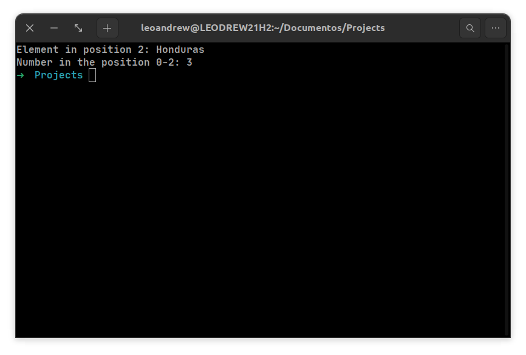

# TITANIUM - ADVANCED TOPICS

## I-ARRAYS AND LISTS

Let's take a list of countries and a 4×4 array of numbers. In Titanium, they can be declared this way:

```jsx
DECL listOfCountries = ["Japan", "Jamaica", "Honduras", "United States", "Brazil"]
DECL arrayOfNumbers = [{1, 2, 3, 4}, {4, 3, 2, 1}, {1, 0, 0, 1}, {0, 1, 1, 0}]
```

Now let's print one of the elements from the list to the console:

```jsx
DECL listOfCountries = ["Japan", "Jamaica", "Honduras", "United States", "Brazil"]
DECL arrayOfNumbers = [{1, 2, 3, 4}, {4, 3, 2, 1}, {1, 0, 0, 1}, {0, 1, 1, 0}]

output("Element in position 2: "..listOfCountries[2])
output("\nNumber in the position 0-2: "..arrayOfNumbers[0][2])
```



> **⚠️ You should pay attention to the fact that the indices of arrays in Titanium start at 0, just like in most programming languages! For example: if you want to retrieve an element at the 5th position, you should use the index 4.**
> 

You can use the insert method to add more elements to an array. Let's add a new country to our list:

```jsx
listOfCountries.insert("France")
```

You can also remove the last element with the pop method. And, if you ever need the length of an array, just use the length method:

```jsx
listOfCountries.pop()
DECL size = listOfCountries.length()
```

---

## II-FOR LOOPS

In order to use a for-loop in Titanium, you use the LOOP keyword and also pass three parameters to it: the variable with its initial value (no need to use DECL here to declare the variable), the condition where the loop will stop, and the increment/decrement with each iteration. For example, if you want to loop from 0 to 10 and increment the variable by 2 with each iteration, you can write it this way:

```jsx
LOOP(i = 0, i < 10, i += 2):
	 --Instructions to be executed during the loop
END
```

We can use loops to loop through an array and print out all of its elements, for example. Let’s see how it works:

```jsx
DEF array = [1, 2, 3, 4, 5, 6, 7, 8, 9, 10, 11, 12, 13, 14, 15]

LOOP(i = 0, i < array.length(), i++):
	output(array[i])
END
```


---

## III-WHILE-DO

The while-do loop in Titanium keeps executing a specific block of code until a specified condition is met. You can use RET to get out of a loop earlier and JUMP to jump straight to the next iteration. Example:

```jsx
$$
It keeps printing the result of the division between x and y until y equals to 0.
If the result of the division is larger than 1, it gets out of the loop
If it is equal to 1, it jumps to the next iteration
$$

DECL result
DECL x = 200, y = 100

WHILE (y > 0) DO:
	result = x % y
	
	IF result > 1:
		RET
	ELIF result IS 1:
		JUMP
	END
	
	x--
	y--
END
```

---

IV-SWITCH CASE

V-MODULES AND EXPORTS

VI-USING LIBRARIES
