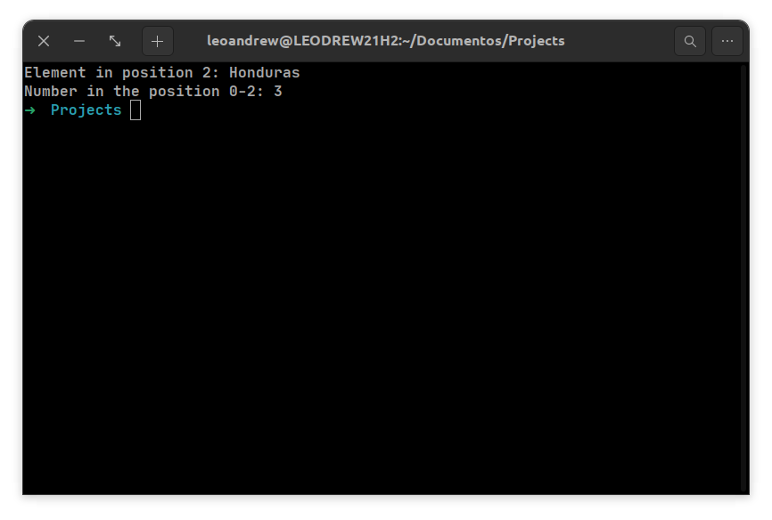

# TITANIUM - ADVANCED TOPICS

## I-ARRAYS AND LISTS

Let's take a list of countries and a 4×4 array of numbers. In Titanium, they can be declared this way:

```jsx
DECL listOfCountries = ["Japan", "Jamaica", "Honduras", "United States", "Brazil"]
DECL arrayOfNumbers = [{1, 2, 3, 4}, {4, 3, 2, 1}, {1, 0, 0, 1}, {0, 1, 1, 0}]
```

Now let's print one of the elements from the list to the console:

```jsx
DECL listOfCountries = ["Japan", "Jamaica", "Honduras", "United States", "Brazil"]
DECL arrayOfNumbers = [{1, 2, 3, 4}, {4, 3, 2, 1}, {1, 0, 0, 1}, {0, 1, 1, 0}]

output("Element in position 2: "..listOfCountries[2])
output("\nNumber in the position 0-2: "..arrayOfNumbers[0][2])
```



> **⚠️ You should pay attention to the fact that the indices of arrays in Titanium start at 0, just like in most programming languages! For example: if you want to retrieve an element at the 5th position, you should use the index 4.**
> 

You can use the insert method to add more elements to an array. Let's add a new country to our list:

```jsx
listOfCountries.insert("France")
```

You can also remove the last element with the pop method. And, if you ever need the length of an array, just use the length method:

```jsx
listOfCountries.pop()
DECL size = listOfCountries.length()
```

---

## II-FOR LOOPS

In order to use a for-loop in Titanium, you use the LOOP keyword and also pass three parameters to it: the variable with its initial value (no need to use DECL here to declare the variable), the condition where the loop will stop, and the increment/decrement with each iteration. For example, if you want to loop from 0 to 10 and increment the variable by 2 with each iteration, you can write it this way:

```jsx
LOOP(i = 0, i < 10, i += 2):
	 --Instructions to be executed during the loop
END
```

We can use loops to loop through an array and print out all of its elements, for example. Let’s see how it works:

```jsx
DEF array = [1, 2, 3, 4, 5, 6, 7, 8, 9, 10, 11, 12, 13, 14, 15]

LOOP(i = 0, i < array.length(), i++):
	output(array[i])
END
```


---

## III-WHILE-DO

The while-do loop in Titanium keeps executing a specific block of code until a specified condition is met. You can use RET to get out of a loop earlier and JUMP to jump straight to the next iteration. Example:

```jsx
$$
It keeps printing the result of the division between x and y until y equals to 0.
If the result of the division is larger than 1, it gets out of the loop
If it is equal to 1, it jumps to the next iteration
$$

DECL result
DECL x = 200, y = 100

WHILE (y > 0) DO:
	result = x % y
	
	IF result > 1:
		RET
	ELIF result IS 1:
		JUMP
	END
	
	x--
	y--
END
```

---

## IV-SWITCH CASE

The switch-case block in Titanium literally means: if x = 0 then execute y, if x = 1 execute z etc. When none of the conditions are met, then the program will execute the ELSE block.

```jsx
DECL command

output("###### MENU ######\n")
output("1-PLAY\n2-SETTINGS\n3-EXIT")
output("Type your choice: ")

get(command)

(command) => {
	1:
		play()
		RET
	2:
		settings()
		RET
	3:
		exit()
		RET
	ELSE:
		output("Please insert a valid option!")
		RET
}
```

---

## V-MODULES AND EXPORTS

You can make any function or variable globally available to other files in your project by using the **EXP** keyword before the function or variable you want to export, then you'll be able to use access them everywhere in your project.

```jsx
EXP DEF PI = 3.14159

EXP DEF power(x, y):
    RET Math.pow(x, y)
END
```

You can export multiple things at once by putting them inside a **MOD** block.

```jsx
MOD myModule:
	DEF function1():
		RET "ABC"
	END

	DEF function2():
		RET "CBA"
	END

	DEF function3():
		RET "DEF"
	END
END

EXP myModule
```

You can then import your functions and modules from another file by using the **IMP** keyword.

```tsx
IMP myModule

function1()
```

Additionally, you can also add na alias by using the keyword **AS**. It could be a shorter name that will be used throughout your code to refer to that imported function, variable, library, etc. in order to avoid lots of typing.

```tsx
IMP function1 AS f 

f() 

$$ ----------------
$$ ----------------

IMP myModule AS m 

m.function3()
```

Furthermore, you can import files from other folders by using the **FROM** keyword, like in the example below:

```tsx
IMP draw FROM 'fake-game-engine/graphics.t'
IMP @ AS image FROM 'image.png'

DECL sprite, x, y

DEF render(path, x, y):
	draw(path, x, y);
	output("Rendered...")
END

render(image, 10, 50)
```

---

## VI-USING LIBRARIES

You can use libraries in Titanium in the same fashion you import modules and other things, but it’ll depend on whether it’s a library that ships together with Titanium or an external library. For example, to import the GUI library Dinosaur, you can just use **IMP**:

```tsx
IMP dinosaur AS gui
```

However, if you want to import an external library, you must indicate the path to its files as well.

```tsx
IMP tellurium AS t FROM "src/lib/stelluroum"
```

---

## VII-FUNCTIONS WITH OPTIONAL PARAMETERS

Sometimes you might want to declare certain function parameters as optional. You can do that by using the **?** sign after the parameter you want to make optional. When you call the function later, you must use **@** instead of the parameter if you don’t want to pass its value. 

```jsx
DEF parameters(x, y?, z):
    IF(y !== NULL)
        output("The y argument is defined")
END

parameters(10, @, 20)
```

---

## VIII-FUNCTION RETURN TYPES

Although optional in Titanium, you can define the return type of a function in order to reduce the risk of erros and preventing it from returning values of a type other than the one it was supposed to return. You declare the return type after the name of the function. For example:

```tsx
DEF thisFunctionReturnsAString(): STR
    RET "this is a string"
END

DEF thisFuncionReturnsANumber(): REAL
    RET (2 % 5)
END
```